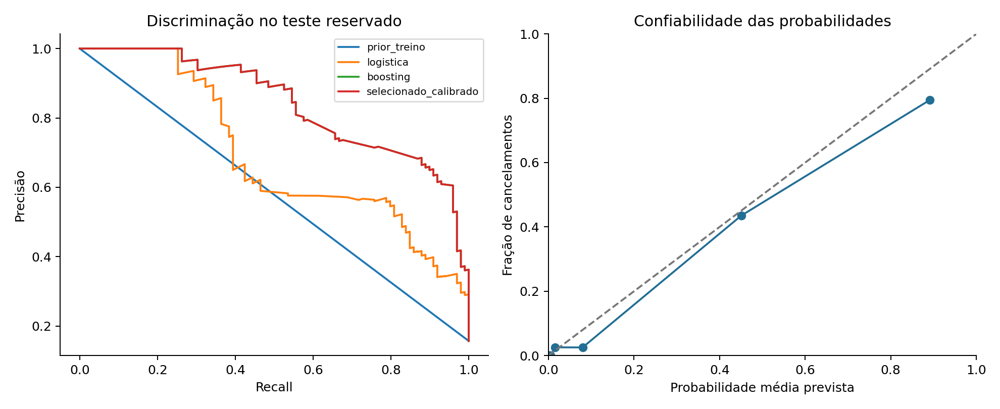

# Churn: priorização de clientes para retenção

**Como priorizar uma ação de retenção quando só há capacidade para contatar uma parte da carteira?**

Projeto de ciência de dados que transforma previsão de cancelamento em uma fila de contato, com controle da separação dos dados, avaliação de probabilidades e incerteza dos resultados.

*Customer churn prioritization with grouped validation, probability calibration and capacity-constrained evaluation.*

## Painel interativo

Abra `painel/index.html` no navegador, sem instalar dependências. O painel mostra o ranking de teste, a distribuição de riscos e um controle de capacidade de contato entre 5% e 30%, com precisão, recall, lift e exportação da fila em CSV. Usa HTML, CSS, JavaScript e SVG, funciona offline e adapta a disposição ao tamanho da tela.

Os indicadores vêm das previsões reais do teste reservado. Alterar a capacidade é exploração histórica, não otimização de política nem prova de impacto. A política principal permanece 10%. O desfecho observado é exibido apenas para avaliação retrospectiva; não estaria disponível no momento de uma campanha.

Após reproduzir a análise, execute `python gerar_painel.py` para atualizar `painel/dados.js`. O arquivo gerado já acompanha o projeto.

## Resultado no teste reservado

| Indicador | Resultado |
|---|---:|
| Clientes de teste | 631 |
| Cancelamentos no teste | 99 |
| Contatos com capacidade de aproximadamente 10% | 64 |
| Cancelamentos identificados entre os priorizados | 54 |
| Precisão da fila | 84,4% |
| Recall da fila | 54,5% |
| Lift sobre a prevalência do teste | 5,38 vezes |
| Average precision | 0,836 |

O limite de 10% é arredondado para cima. O lift compara a precisão da fila com a prevalência do teste, que é o valor esperado de uma seleção aleatória. A linha `prior_treino` no CSV também mostra uma realização com desempate aleatório fixo, que naturalmente pode ter lift diferente de 1.

O resultado apoia **priorização de contato**, sem demonstrar retenção efetiva. Não há informação sobre resposta a uma campanha. O próximo passo proposto é um experimento com grupo de controle.



[Leia a análise dos resultados e limitações](resultados/relatorio.md).

## Protocolo

1. Os atributos são agregados dos primeiros nove meses; o desfecho é observado ao final de doze meses, conforme a fonte.
2. Mantemos os 3.150 clientes. Clientes com perfis idênticos nos nove preditores usados ficam na mesma partição; não são eliminados como duplicatas.
3. A divisão por perfil e aproximadamente estratificada reserva cerca de 60% para treino, 20% para calibração e 20% para teste.
4. Regressão logística e gradient boosting são ajustados em cinco folds agrupados do treino. A seleção usa average precision média, adequada ao interesse no ranking da classe minoritária.
5. O modelo escolhido é calibrado por sigmoide usando apenas a partição de calibração. A política de capacidade principal é 10%, definida antes do teste.
6. O teste mede average precision, ROC-AUC, Brier, precisão, recall e lift. Um bootstrap de 2.000 reamostragens de perfis fornece um IC exploratório do lift, condicionado ao modelo treinado.

A calibração não foi automaticamente uma melhoria: o Brier passou de aproximadamente 0,0544 para 0,0552 no teste. O relatório preserva esse resultado; o teste não foi usado para escolher retroativamente entre probabilidades originais e calibradas. Brier combina calibração e discriminação, portanto não é uma medida isolada de calibração.

## Atributos e decisões

| Campo usado | Interpretação |
|---|---|
| falhas_chamada | Quantidade de falhas |
| reclamacao | Indicador de reclamação |
| meses_assinatura | Tempo de relacionamento |
| faixa_cobranca | Categoria ordinal de cobrança, não valor monetário |
| segundos_uso | Duração acumulada das chamadas |
| numero_chamadas | Frequência de chamadas |
| numero_sms | Frequência de SMS |
| numeros_distintos | Quantidade de números distintos chamados |
| plano | Categoria binária do plano |

`Status` é excluído por decisão conservadora sobre uso operacional; a fonte o descreve como atributo anterior ao desfecho, portanto não afirmamos vazamento comprovado. `Customer Value` não é usado porque sua fórmula é insuficiente para interpretação econômica. `Age` e `Age Group` são excluídos para concentrar o estudo em comportamento de uso; isso, por si só, não constitui auditoria de equidade.

Não há datas individuais suficientes para avaliação temporal. O resultado não demonstra desempenho futuro, em outra operadora ou em clientes brasileiros. Campos correlacionados tornam a importância por permutação uma análise de dependência preditiva, não causal.

## O que este repositório demonstra

Formulação de problema, tratamento de classe minoritária, prevenção de compartilhamento de perfis entre conjuntos, pipelines, validação cruzada, calibração, métricas de capacidade, bootstrap agrupado, SQL e comunicação da decisão apoiada pelos dados.

## Fontes

- [Iranian Churn — UCI](https://archive.ics.uci.edu/dataset/563/iranian+churn+dataset), DOI [10.24432/C5JW3Z](https://doi.org/10.24432/C5JW3Z), CC BY 4.0. Acesso em 02/10/2026.
- [Documentação oficial: calibração de probabilidades](https://scikit-learn.org/stable/modules/calibration.html).
- [Documentação oficial: validação cruzada](https://scikit-learn.org/stable/modules/cross_validation.html).

## Execução no Windows

Use Python 3.12. No terminal do VS Code, dentro da pasta deste repositório:

```powershell
py -3.12 -m venv .venv
.venv\Scripts\python.exe -m pip install -r requirements.txt
.venv\Scripts\python.exe analise.py
.venv\Scripts\python.exe auditar_sql.py
.venv\Scripts\python.exe -m unittest discover -s tests -v
.venv\Scripts\python.exe prever.py exemplo_entrada.csv novas_previsoes.csv
```

No Linux/macOS, crie o ambiente com `python3.12 -m venv .venv` e use `.venv/bin/python` nos demais comandos. O script `prever.py` exige executar a análise primeiro, para criar `resultados/modelo.joblib`. Esse modelo local não integra o pacote nem o versionamento; é reconstruído pelo pipeline.

Os dados originais já acompanham o projeto. Para baixá-los novamente, execute `python dados.py`; o download valida SHA-256 antes de escrever os arquivos. `fonte.json` registra autoria, licença, URL e hashes. Os programas não dependem de API paga, servidor ou credencial. O painel estático abre diretamente no navegador.

O notebook `estudo.ipynb` contém as células executadas e os resultados, para leitura no GitHub e reprodução no Jupyter ou VS Code. Instale o suporte Jupyter separadamente se desejar usá-lo; o pipeline principal funciona apenas com as dependências de `requirements.txt`.

## Organização

| Arquivo | Responsabilidade |
|---|---|
| `analise.py` | Executar seleção, avaliação, gráficos estáticos e relatório |
| `modelagem.py` | Regras de preparação, métricas e reamostragem |
| `prever.py` | Aplicar o modelo a um CSV sem conhecer o resultado real |
| `gerar_painel.py` e `painel/` | Exportar os resultados para o painel interativo offline |
| `dados.py` | Download e verificação de integridade |
| `auditar_sql.py` e `sql/` | Conferência independente de agregações ou atributos |
| `tests/` | Testes dos riscos de erro relevantes ao problema |
| `resultados/` | Evidências da execução, métricas e conclusões |
| `.github/workflows/testes.yml` | Testes, reprodução da análise, auditoria SQL e entrega dos resultados a cada push ou pull request |

## Reprodutibilidade e escopo

Semente 42, dependências fixadas e versão de Python registrada em `ambiente.txt`. As partições e regras de escolha são auditáveis. Resultados são de avaliação offline em dados históricos, não impactos realizados em uma empresa. Os diagnósticos do teste não alimentam novo ajuste. Comentários não são usados no código; decisões e definições ficam na documentação.

## Licença

Código MIT. Dados e tabelas derivadas sob CC BY 4.0, com atribuição em `fonte.json`. Os projetos não são vinculados à operadora, ao sistema de bicicletas ou à UCI.

## Tecnologias utilizadas

| Tecnologia | Uso neste projeto | Competência demonstrada |
|---|---|---|
| HTML, CSS, JavaScript e SVG | Painel de decisão com capacidade interativa e exportação CSV | Comunicação de resultados e desenvolvimento de interface |
| Python 3.12 | Pipelines e comandos de treino e previsão | Programação aplicada a dados |
| pandas e NumPy | Preparação, atributos, métricas e reamostragem | Manipulação de dados e estatística computacional |
| scikit-learn | Pipelines, modelos e seleção | Machine learning com avaliação reproduzível |
| SQL e SQLite | Conferência independente de resultados | Consultas, agregações e funções de janela |
| Jupyter Notebook | Estudo com resultados executados | Comunicação técnica e exploração reproduzível |
| Matplotlib | Diagnósticos e gráficos estáticos | Avaliação e comunicação dos modelos |
| unittest | Testes de partições, métricas ou vazamento | Qualidade e prevenção de erros |
| GitHub Actions | Fluxo automático de testes e reprodução | Integração contínua de projeto de dados |
| joblib | Serialização local para inferência | Separação entre treinamento e uso do modelo |

O fluxo de GitHub Actions está configurado para reproduzir a análise e executar testes a cada push ou pull request. Os testes locais passaram; o estado de cada execução remota pode ser consultado na aba Actions.
